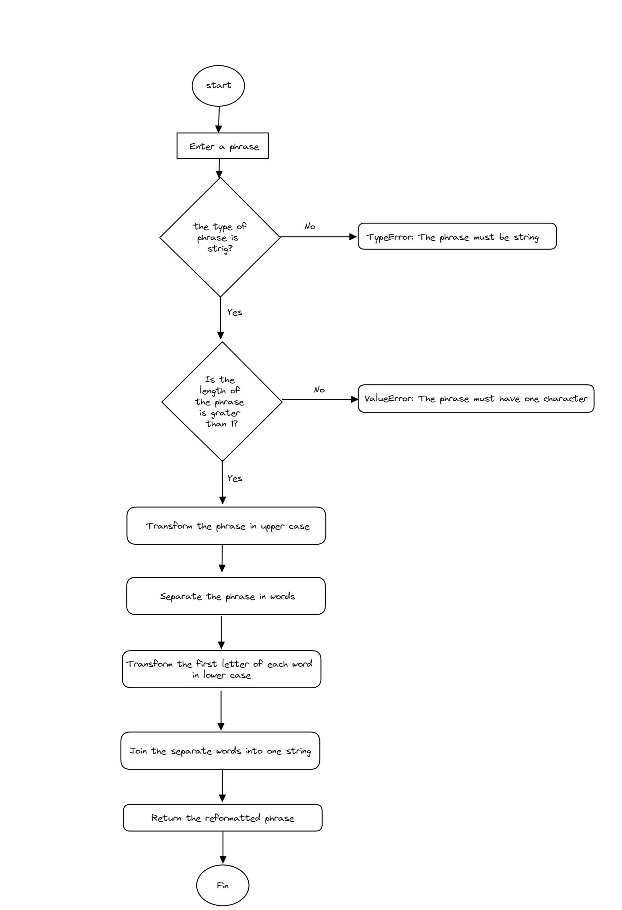

# 📑 Challenge reformat string 📑

## Challenge 👨‍💻

Create a function that receives a sentence which you have to modify so that it returns a text string where the first letter of each word in the sentence is lowercase and the others are uppercase.

Example:
input: this is an example
output: tHIS iS aN eXAMPLE

## Flowchart 💡

Algorithm - workflow

